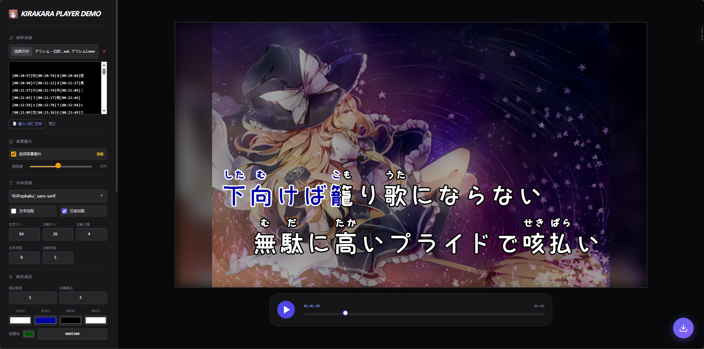

# 🎤 Kirakara Player

基于浏览器的卡拉 OK 歌词播放器与视频导出工具。



## ✨ 功能特性

- **逐字走字动画** — 支持 LRC 时间轴驱动的逐字染色效果
- **视频背景** — 支持 MP4 视频作为背景
- **静态背景图** — 支持上传图片作为背景，可调节透明度
- **高度可定制** — 字体、字号、颜色、描边、淡入淡出、指示灯等全部可调
- **实时预览** — 1280×720 预览窗口，所见即所得
- **导出视频** — 支持 VP8 / VP9 / H.264 编码，最高 60fps

## 🚀 使用方式

### 本地运行

1. 用 **Chrome 94+** 或 **Edge 94+** 打开 `index.html`
2. 加载音频或视频文件
3. 粘贴或载入 `.lrc` 歌词
4. 点击播放按钮预览效果
5. 点击右下角导出按钮生成视频

### 部署到服务器

本项目为纯静态文件，无需构建。将整个目录上传到任意静态文件服务器即可：

```
# 示例：使用 nginx
server {
    listen 80;
    server_name kirakara.example.com;
    root /var/www/kirakara-player;
    index index.html;
}
```

也支持直接托管在 GitHub Pages、Vercel、Netlify 等平台。

> **注意**：导出视频为纯视频流（WebM），不含音频。请自行使用 FFmpeg 等工具混流音轨。

## 📁 项目结构

```
Kirakara Player Demo/
├── index.html              # 主页面（React 18 + Tailwind + Babel JSX）
├── css/
│   └── style.css           # 自定义样式
├── js/
│   ├── parser.js           # LRC + @Ruby 歌词解析器
│   ├── dom-renderer.js     # DOM 预览渲染器
│   ├── canvas-renderer.js  # Canvas 2D 导出渲染器
│   ├── exporter.js         # 导出流水线（核心）
│   ├── codec.js            # 编码器配置与候选回退
│   ├── muxer.js            # WebM EBML 封装器
│   └── shared/
│       ├── config.js       # 默认配置 & localStorage 持久化
│       ├── parser.js       # 共享解析工具
│       ├── measure.js      # 文字测量
│       ├── progress.js     # 进度状态计算
│       └── utils.js        # 通用工具
├── images/
│   ├── logo.png
│   └── preview.png
└── README.md
```

## 🎨 可配置项

| 分类 | 配置项 |
|------|--------|
| **字体排版** | 字体名、主字大小/粗细/间距、注音大小/粗细/间距/上推 |
| **颜色描边** | 走字前/后颜色、描边前/后颜色、描边粗细 |
| **淡入淡出** | 启用/关闭、仅段落首尾、持续时长 |
| **指示灯** | 启用/关闭、持续时间、大小、颜色、描边、位置偏移 |
| **布局** | 歌词行 1/2 的 X/Y 坐标 |
| **背景** | 背景色、背景图片启用、图片透明度 |

所有配置自动保存到 `localStorage`，刷新不丢失。

## 📦 外部依赖

| 库 | 加载方式 | 用途 |
|----|---------|------|
| React 18 | unpkg CDN | UI 框架 |
| ReactDOM 18 | unpkg CDN | DOM 渲染 |
| Tailwind CSS | CDN | 原子化样式 |
| Babel Standalone | unpkg CDN | 浏览器端 JSX 转译 |
| mp4box 0.5.2 | unpkg CDN | MP4 解封装与 avcC 提取 |

> 所有依赖均通过 CDN 加载，无需 `npm install` 或构建工具。

## 🌐 浏览器兼容性

| 特性 | Chrome | Edge | Firefox | Safari |
|------|--------|------|---------|--------|
| 预览播放 | 94+ ✅ | 94+ ✅ | ✅ | ✅ |
| 导出功能 | 94+ ✅ | 94+ ✅ | ❌ | 16.4+ ⚠️ |

> Firefox 不支持 WebCodecs API。Safari 16.4+ 部分支持，未充分测试。

## ⚠️ 已知限制

- 导出为 WebM 格式时不含音频流，需后期混流
- 后台标签页导出时编码器 `flush()` 可能受 Chrome 节流影响而变慢
- H.264 软件编码在部分平台可能不可用

## Todo
- [x] 自动角色解析功能
- [x] 导出视频为mp4格式且含有音轨
- [ ] 双注音功能
- [ ] 阴影等装饰性功能

## 📄 License

本项目遵循MIT协议。

